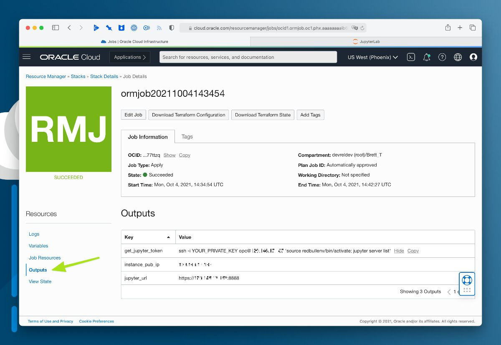

# Beginners Hands-On Lab

## Prerequisites

You'll need an OCI free trial account: <a href="https://signup.cloud.oracle.com/?sourceType=_ref_coc-asset-opcSignIn&language=en_US" target="_blank" title="Sign up for free trial">click here to sign up</a> (right click and open in a new tab so you can keep these instructions open).

Registered lab participants should have received $500 in credits to use for Data Science operations.

Here's [a video to help with signing up.](https://www.youtube.com/watch?v=4U-0SumNz6w)

## Lab Guide

A PDF version of the slide deck for this lab is [available here](https://raw.githubusercontent.com/oracle-devrel/redbull-analytics-hol/main/beginners/docs/Red-Bull-HOL.pdf) (right click to save to disk or open in a new tab).

### SSH Key

You'll also need an SSH key pair to access the OCI Stack we're going to create. For Mac/Linux systems, you can [use `ssh-keygen`](https://docs.oracle.com/en-us/iaas/Content/Compute/Tasks/managingkeypairs.htm#ariaid-title4). On Windows, you'll [use PuTTY Key Generator](https://docs.oracle.com/en-us/iaas/Content/Compute/Tasks/managingkeypairs.htm#ariaid-title5). Again, right click the appropriate link and open in a new tab so you don't lose this page.

To summarize Mac/Linux:

    ssh-keygen -t rsa -N "" -b 2048 -C "<key_name>" -f <path/root_name> 

For Windows, and step-by-step instructions for Mac/Linux, please see the [Oracle Docs on Managing Key Pairs](https://docs.oracle.com/en-us/iaas/Content/Compute/Tasks/managingkeypairs.htm#Managing_Key_Pairs_on_Linux_Instances).

## Getting Started

1. Click the button below to begin the deploy of the Data Science stack and custom image:
    
    <a href="https://cloud.oracle.com/resourcemanager/stacks/create?region=home&zipUrl=https://github.com/oracle-devrel/redbull-analytics-hol/releases/latest/download/redbull-analytics-hol-latest.zip" target="_blank"></a>
2. If needed, log into your account. You should then be presented with the **Create Stack** page. 
    
    These next few steps will deploy a stack to your OCI tenancy. This will include the necessary tools to deploy and run JupyterLab from within your OCI account.

    Under *Stack Information* (the first screen), check the box *I have reviewed and accept the Oracle Terms of Use*. Once that box is checked, the information for the stack will be populated automatically.
    
    
3. Click **Next** at the bottom of the screen. This will take you to the **Configure Variables** page. On this page you'll need to provide the SSH key we created in the prerequisites. You can copy and paste the contents of the public key (`.pub`), or use the file selector to upload the `.pub` file directly.

    
4. On the **Review** page, be sure *Run Apply* is checked, and click **Create**.

    
5. This will take you to the **Job Details** page, and OCI will begin creating the stack and deploying the scripts for the lab. This will take 8-10 minutes. When it completes (assuming everything went smoothly), the **Job Details** will show a bright green square with "Succeeded" below it.
    
    
6. Once the Create Stack job has succeeded, click "Outputs."

    

    The outputs will include a terminal command you'll need to run. Replace the private key reference with the path to the private key that matches the public key you uploaded. The final command should look similar to:

    ```console
    $ ssh -i ~/.ssh/id_rsa2 opc@123.456.789.100 'source redbullenv/bin/activate; jupyter server list'
    ```

7. Open a terminal and run the above command. The output of the command will include a url containing a token. You'll need the token portion of the url (the part after `?token=`) for the next step.

    
8. Back in the **Outputs** display in your browser, copy the IP address for your Jupyter Lab (ending with `:8888`). Paste that into a new browser window/tab and append `?token=YOUR_TOKEN`, replacing `YOUR_TOKEN` with the token from step 7. Load the resulting URL.

    
9. Your new deployment uses a self-signed certificate, so you'll get a warning from your browser that the connection is insecure. You'll need to approve the loading of the page. In most browsers you'll see an "Advanced" or similar button, and clicking it will offer you the option to ignore security concerns and load the page anyway.

    You'll need to repeat the security approval procedure when loading the Flask app created by the lab.

    _**Note:** You should not be on VPN when opening JupyterLab._
    
10. You should now see the JupyterLab. Navigate in the sidebar to `/redbull-analytics-hol/beginners/` to see the Jupyter notebooks for this lab.

## Up and Running

From this point on, please refer to the slide deck being presented on Zoom. You can use [the PDF](https://raw.githubusercontent.com/oracle-devrel/redbull-analytics-hol/main/beginners/docs/Red-Bull-HOL.pdf) for reference as you go.

## Starting The Web Application

When you get through the notebooks, you'll need to start the web server to see your results. We're including these commands here in the README for clarity (and so you can copy/paste).

1. In the JupyterLab menu at the top of the page, select **File->New->Terminal**.
2. Enter the following commands, hitting return after each one (feel free to copy and paste)

        ./launchapp.sh start

    To stop the server later, if needed, use:

        ./launchapp.sh stop
3. Open a web browser to the public IP of your JupyterLab, but use port 8080 instead of port 8001:

        http://xxx.xxx.xxx.xxx:8080

    The Public IP is the one at which you're currently accessing JupyterLab, which we copied from the Running Instances step above.
